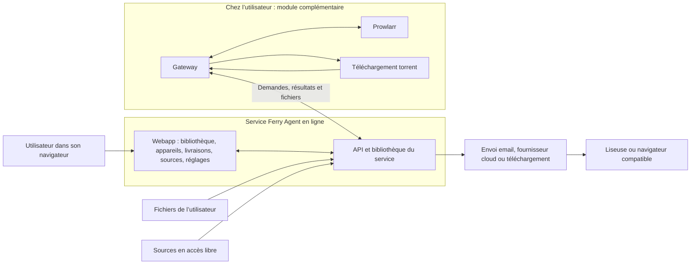
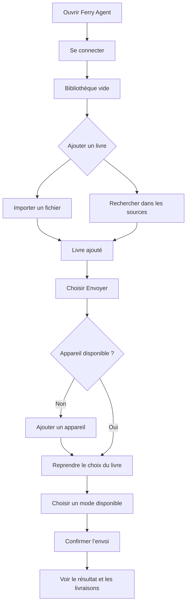

# 02 — Modèle produit et UX cible

Les schémas et choix de navigation de ce chapitre sont des **recommandations**. La frontière cloud/local est une exigence produit de la mission.

## 1. Promesse et responsabilités

> Ferry Agent rassemble vos livres dans une bibliothèque en ligne et vous aide à les envoyer sur votre liseuse. Le Gateway, installé chez vous si vous en avez besoin, relie vos sources locales au service.

Cette formulation est une proposition de texte à adapter en FR/EN ; elle ne promet ni synchronisation universelle, ni lecture confirmée, ni absence de stockage côté service.

| Objet | Question utilisateur | Lieu de gestion cible | Responsabilité |
|---|---|---|---|
| Bibliothèque | Quels livres ai-je ajoutés ? | Webapp cloud | Collection personnelle, métadonnées, préparation de l’envoi |
| Appareil | Où envoyer ce livre ? | Webapp cloud | Destination, mode d’envoi disponible, liaison éventuelle à un fournisseur |
| Livraison | Qu’est-il arrivé à mon envoi ? | Webapp cloud | État de l’opération, téléchargement éventuel, explication des échecs |
| Source | Où chercher des livres ? | Webapp cloud | Activation et compréhension des sources |
| Réglages | Quels choix garder par défaut ? | Webapp cloud | Préférences et liens de catalogue pour liseuse |
| Gateway | Comment relier mes sources installées chez moi ? | Pilotage dans la webapp, exécution locale | Communication Prowlarr, recherche locale et téléchargement torrent |

### Schéma de responsabilité proposé

**F — base logicielle du schéma :** lectures/mutations via `web/lib/api.ts` et `web/lib/api-client.ts` ; stockage dans `src/ferry_agent/services/library.py` ; agent local dans `gateway/agent/ferry_gateway_agent/worker.py`, `prowlarr.py` et `transmission.py` ; livraison dans `src/ferry_agent/services/delivery.py`. La position du schéma exprime le cadrage produit ; les garanties exactes d’exploitation restent à confirmer.

**R :** sur l’accueil, convertir ce schéma technique en une illustration à trois libellés simples : « Votre bibliothèque en ligne », « Votre liseuse », « Gateway chez vous — si nécessaire ». Conserver une flèche des fichiers vers la bibliothèque en ligne. Aucun serveur local ne doit englober toute l’application.

## 2. Architecture de l’information

### Navigation principale proposée

1. **Bibliothèque** — écran d’entrée, collection et ajout de livres.
2. **Livraisons** — suivre les envois.
3. **Appareils** — destinations et connexions.
4. **Sources** — catalogues utilisés pour la recherche.
5. **Gateway** — module installé chez vous, disponibilité et installation.
6. **Réglages** — préférences et catalogue liseuse.

Groupe principal « Vos livres » pour les trois premiers ; groupe secondaire « Préférences et connexions » pour les trois suivants. Éviter les compteurs décoratifs. Conserver un accès au guide et au compte sans multiplier les groupes.

**F :** les six routes existent ; l’ordre actuel est bibliothèque, appareils, accès, sources, livraisons, réglages (`web/components/app/app-sidebar.tsx`). **R :** modifier les libellés et l’ordre sans renommer les URL ni perdre les préfixes FR/EN. `/app/gateways` peut afficher « Gateway » avec une description simple. Si « Accès » est conservé pour continuité, toujours préciser « module installé chez vous » à la première occurrence.

### Répartition des responsabilités

- Sources possède les interrupteurs de recherche ; Réglages propose seulement un lien et une courte synthèse. **F :** les deux pages montent actuellement `SourcesManager` (`web/components/app/settings/settings-form.tsx`, `web/app/[locale]/app/sources/page.tsx`).
- Les connexions Dropbox/Drive restent avec l’appareil concerné. Le mot « cloud » désigne ici le fournisseur de destination ; le distinguer de l’hébergement cloud de Ferry Agent.
- « Catalogue sur votre liseuse » reste dans Réglages, avec renvoi depuis Appareils. Expliquer OPDS en aide secondaire, sans créer une rubrique technique obligatoire.
- L’accueil explique le service. Le guide commence par « Utiliser Ferry Agent en ligne » et propose un chapitre Gateway optionnel ; ne pas faire commencer tous les nouveaux utilisateurs par Docker.
- L’assistant IA est une voie complémentaire. Ne pas transformer la webapp en page d’administration d’un assistant.

## 3. Parcours de référence

### A — Première utilisation, sans Gateway

**R :** permettre d’ajouter un livre avant de configurer un appareil. Si l’envoi nécessite une configuration, conserver le livre comme contexte et permettre la reprise. Ne pas inventer une route de retour avec des identifiants secrets ; cette reprise demande un petit état UI explicite.

### B — Utilisation récurrente

Bibliothèque remplie → retrouver un livre possédé → détails → appareil/mode → résultat → suivi. Le bouton principal « Ajouter des livres » ouvre deux options : « Importer un fichier » et « Rechercher dans les sources ». Une recherche locale dans la collection doit être distincte.

**F :** l’input de recherche existant cherche dans les sources et les jobs Gateway ; il ne filtre pas la collection (`web/components/app/library/library-view.tsx`). **R :** ne pas le rebaptiser « Rechercher dans ma bibliothèque » sans implémenter le comportement correspondant.

### C — Sources locales

Sources → explication du Gateway → créer les codes dans la webapp → installer le module local selon le guide réellement validé → constater la connexion dans la webapp → rechercher et ajouter → voir le livre rejoindre la bibliothèque en ligne.

**F :** deux secrets sont affichés à la création (`web/components/app/gateways/create-gateway-dialog.tsx`) et le Gateway transmet le fichier après téléchargement (`gateway/agent/ferry_gateway_agent/worker.py`). **R :** ne pas présenter le stockage local temporaire comme la bibliothèque de référence.

### D — Incident

L’action conserve son contexte → message décrivant ce qui a échoué → reprise sûre → lien vers le réglage concerné si nécessaire. Exemple : « Ce compte n’est pas encore relié. Reliez Dropbox pour envoyer ce livre. » Préférer « Actualiser l’état » à « Renvoyer » lorsque le succès de la première requête est incertain.

## 4. Modèle des états

| Dimension | États à distinguer | Effet UX |
|---|---|---|
| Chargement de données | Initial, disponible, vide, partiel, indisponible, dernière valeur connue | Un écran vide ne signifie jamais automatiquement absence de données |
| Action | Prête, validation, en cours, succès, erreur, résultat incertain | Pas de doublon pendant une mutation ; reprise adaptée à la cause |
| Gateway | En attente, code expiré, connecté, hors ligne, révoqué | Le hors-ligne local ne signifie pas indisponibilité de toute la webapp |
| Livraison | En attente, envoyé, terminé selon le mode, échec | Ne pas assimiler terminé à lu ou synchronisé sur la liseuse |
| Source | Activée/désactivée et disponible/indisponible/inconnue | Ne pas inventer un état réseau à partir d’un simple flag d’activation |

**F :** statuts et champs actuels proviennent de `web/lib/types.ts`, `web/lib/api-types.generated.ts`, `src/ferry_agent/schemas.py` ; les nuances de présentation proposées ne créent pas de nouveaux statuts backend.

## 5. Microcopie de référence — R

| Situation | Proposition FR |
|---|---|
| Accueil | « Vos livres, prêts pour votre liseuse. » |
| Description produit | « Retrouvez votre bibliothèque en ligne, ajoutez des livres et choisissez où les envoyer. » |
| Gateway | « Un module à installer chez vous pour utiliser vos sources locales. » |
| Collection vide | « Votre bibliothèque commence ici. Ajoutez votre premier livre. » |
| Panne de chargement | « Impossible de charger votre bibliothèque. Réessayez. » |
| Recherche sans résultat | « Aucun livre trouvé. Essayez un autre titre ou auteur. » |
| Délai de suivi dépassé | « Le suivi prend plus de temps que prévu. Consultez l’activité du Gateway avant de recommencer. » |
| Révocation | « Ce module ne pourra plus se connecter à votre compte. » |

Ces textes doivent être validés avec le comportement réel, puis traduits symétriquement. Ils suivent la charte [ADR 0007](../adr/0007-charte-documentation-non-technique.md). Éviter « job », « tier », « endpoint », « token » dans la navigation et les messages ; les noms des variables à copier restent des données exactes.

## 6. Mesurer le résultat

Recette proposée : un nouveau lecteur distingue spontanément la webapp du Gateway ; il ajoute un livre sans installer le Gateway ; il trouve les livraisons depuis la confirmation d’envoi ; il retrouve le réglage d’une source sans hésiter entre deux écrans. Mesurer le nombre de blocages et les causes pendant un test, sans inventer de taux de conversion existant ni ajouter une collecte de données dans ce lot.
